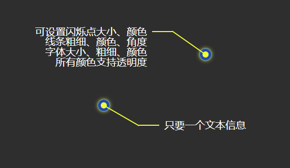

# 个人开发jQuery插件库

## 闪烁点提示信息 - dotTip
* 示例代码
```javascript
//最简单写法
$.dotTip({
    "obj_text": "只要一个文本信息"
});

//最全参数写法
$.dotTip({
    "obj_pos": $('#dot'), //存放容器
    "pos_left": 400, //整体定位：距左
    "pos_top": 100, //整体定位：距上
    "dot_radius": 12, //点内直径
    "dot_padding": 5, //点内边距
    "dot_border": 2, //点边框宽度
    "line_angle": -145, //斜线角度
    "line_width1": 80, //线1长度
    "line_width2": 40, //线2长度
    "line_color": "#F1FF11", //线条颜色、圆点内圈颜色
    "line_bg": "#2050B9", //圆点外圈颜色
    "obj_text": "可设置闪烁点大小、颜色<br>线条粗细、颜色、角度<br>字体大小、粗细、颜色<br>所有颜色支持透明度", //文字描述
    "obj_font": 20, //文字描述字体大小
    "obj_color": "#FFF", //文字描述字体颜色
    "obj_bold": "normal", //文字描述字体粗细
    "obj_delay": 1500 //延时加载
});
```
* 效果图
> 

## 颜色HEX与RGBA之间转换 - colorTrans
* 示例代码
```javascript
console.log($.colorTrans("#FC0"));
console.log($.colorTrans("#DAFBFC", false));
console.log($.colorTrans("rgba(214, 124, 137, .5)", true));
console.log($.colorTrans("rgb(255, 166, 0)", true));
```
* 参数说明
    * 第一个参数（必填）：要转换的字符串
    * 第二个参数（非必填）：true从RGB或RGBA转HEX  false则从HEX转RGBA
* 返回结果{}
    * 从RGB或RGBA转HEX：{COLOR:...,OPACITY:...}
    * 从HEX转RGBA：{STR:...,RGB:...,RGBA:...}
